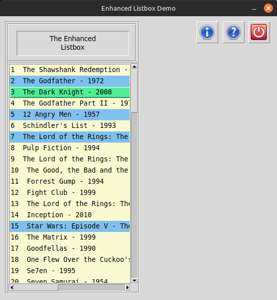

# EnhancedScrolledListbox
A project showing how to create an Enhanced Scrolled Listbox

Welcome to my repository for The Enhanced Listbox demo.  
  
This project shows how you can create your own Enhanced Listbox using PAGE. It operates as a normal ScrolledListbox so when the user clicks with <Button-1> the selection shows in green (configurable) and when the user clicks with <Button-3> the items show up in blue (again configurable).  
  
All code is in Python. With a little bit of work this project can be used in just about any Tkinter program.  
  
